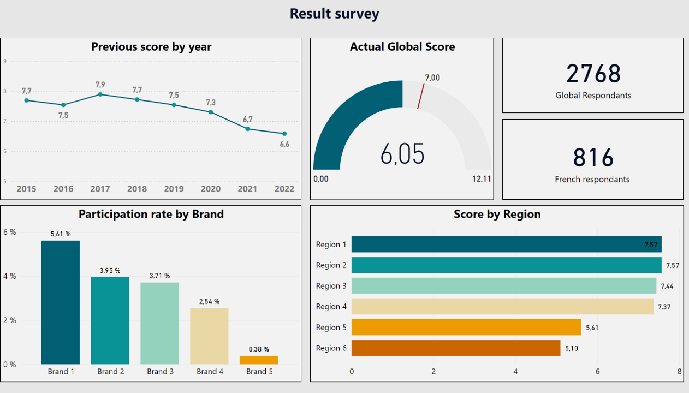
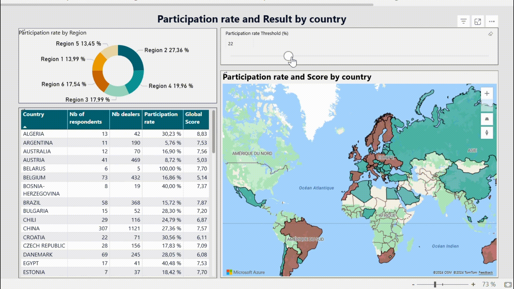

# Customer Satisfaction Survey Analysis & Power BI Dashboard

## Overview
This project demonstrates my ability to analyze and visualize customer satisfaction survey data for an automotive diagnostic tool, combining quantitative insights from Power BI dashboards and qualitative findings from text analysis in Dataiku. The key business challenges addressed include:

- Identifying regions with low satisfaction scores.
- Understanding gaps in survey participation.
- Uncovering specific reasons for customer dissatisfaction.

The results have supported decision-makers in improving customer experience, boosting participation, and prioritizing areas for improvement.
## Key Components

### 1. Power BI Dashboard
An interactive dashboard designed to help regional managers visualize and analyze survey results.

#### Key Features:

- ### **Global Overview:** 
  Tracks satisfaction trends and participation rates across regions and brands.
  
  
  
  - **Satisfaction Trend (Line Chart):** Displays changes in satisfaction scores over time to identify long-term trends.
  - **Current Satisfaction Score (Gauge):** Provides a real-time snapshot of the current satisfaction level.
  - **Brand Participation (Column Chart):** Compares participation rates across different brands, highlighting areas with higher or lower engagement.

- ### **Participation by Country:** 
  Provides detailed insights into participation and satisfaction at the country level.
  
  
  
  - **Participation Rate by Region (Donut Chart):** Highlights the participation rate distribution by region, making it easy to spot regions with low engagement.
  - **Country Map:** Visualizes satisfaction scores and participation rates across countries, helping identify geographical patterns.
  - **Participation Rate Threshold (Slicer):** Allows the user to focus on regions with participation rates below a specific threshold to prioritize improvement efforts.

- ### **Results by Function:** 
  Evaluates satisfaction scores across various user functions.
  
 
  
  - **Average Satisfaction Score by Function (KPI):** Displays the overall satisfaction level for different user groups, helping to target specific areas for improvement.
  - **Country-wise Satisfaction by Function (Table):** Breaks down satisfaction scores for each country by user function, providing granular insights.
  - **Brand Satisfaction by Function (Column Chart):** Compares satisfaction by function across different brands, helping to identify strengths and weaknesses per brand.

#### Interactive Features:
- **Slicers:** Filter data dynamically by region, function, etc.
- **Drillthrough:** Explore deeper data from any visual.
- **Hover-over:** Provides additional context on hover.

#### Key DAX Measures:
- **Participation Rate:**
  ```DAX
  ParticipationRate = CALCULATE(([Nb of respondents] / SUM('Dealers by region'[Nb dealers])))
  ```
- **Threshold Analysis:**
  ```DAX
  Threshold = IF([Participation Rate] >= threshold[threshold Value], 1, 0)
  ```

### 2. Text Analysis Using Dataiku
Classify survey comments into categories of dissatisfaction, providing qualitative insights to complement the quantitative results from the Power BI dashboard.


#### Process:
- **Data Cleaning:** Special characters and extra spaces removed, and text normalized.
- **Text Classification:** Categorized comments into dissatisfaction causes using regex-based NLP rules:
  - Tool Performance Issues
  - User Experience Issues
  - Feature Requests

#### Output:
A summarized list of dissatisfaction causes, with the survey comments separated into different columns for each category (Tool Performance Issues, User Experience Issues, Feature Requests), providing actionable insights for improvement.


## Actions & Outcomes

### Actions Taken:
- On-site visits to key regions with low satisfaction.
- Teleprospecting campaigns to boost participation.
- Analyzed feedback using NLP to identify specific needs and dissatisfaction causes.

### Key Results:
- Optimized satisfaction scores in targeted regions.
- Enhanced communication and transparency in underperforming areas.
- Data-driven actions successfully implemented to improve customer experience.

### Challenges Overcome:
- Developed dynamic slicers for improved interactivity.
- Addressed inconsistent formatting in Excel survey exports for reliable analysis.

## Technologies Used:
- **Power BI:** Dashboard creation, DAX calculations.
- **Dataiku:** Text classification using NLP and regex.
- **Power Query:** Data transformation and preparation.
- **Microsoft Excel & SharePoint:** Data storage.

## Skills Demonstrated:
- **Power BI:** Data visualization, DAX, dashboard design.
- **Dataiku:** NLP-based text classification.
- **Data Cleaning:** Using Power Query and Dataiku.
- **Problem Solving:** Integrating quantitative and qualitative insights for analysis.

## Repository Structure:
```plaintext
/customer-satisfaction-survey/
  ├── README.md
  ├── power-bi-dashboard/
  │     ├── screenshots/
  │         ├── Global-view.png
  │         ├── Participation-and-result-by-country.gif
  │         ├── Result-by-function.png

